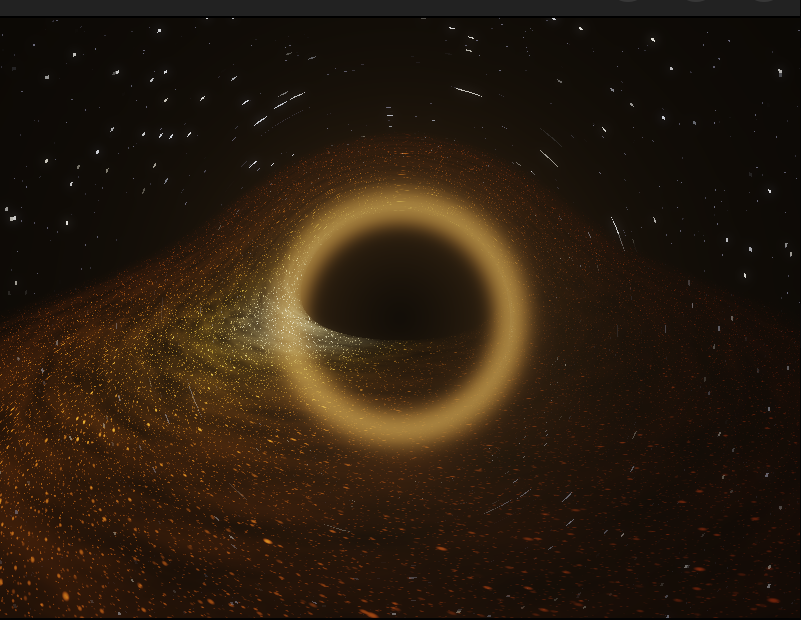
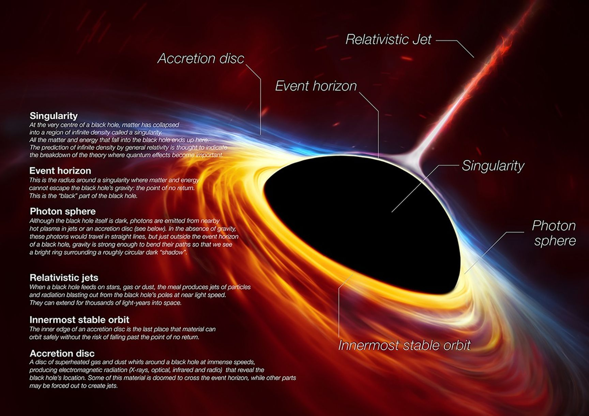
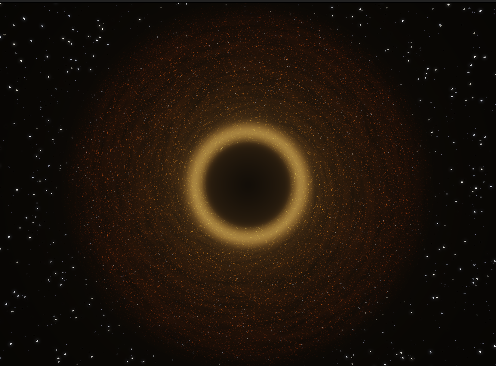
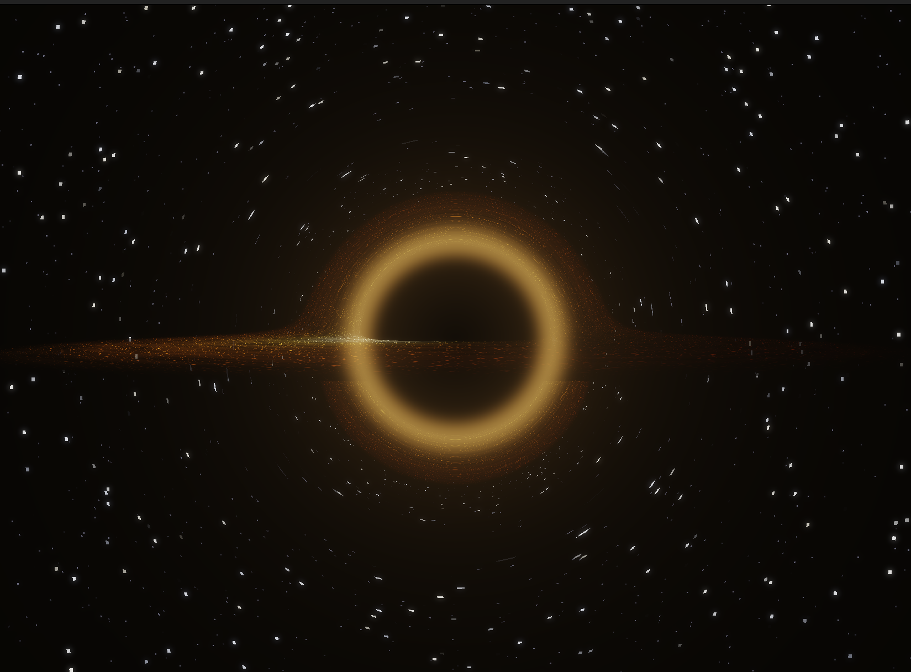
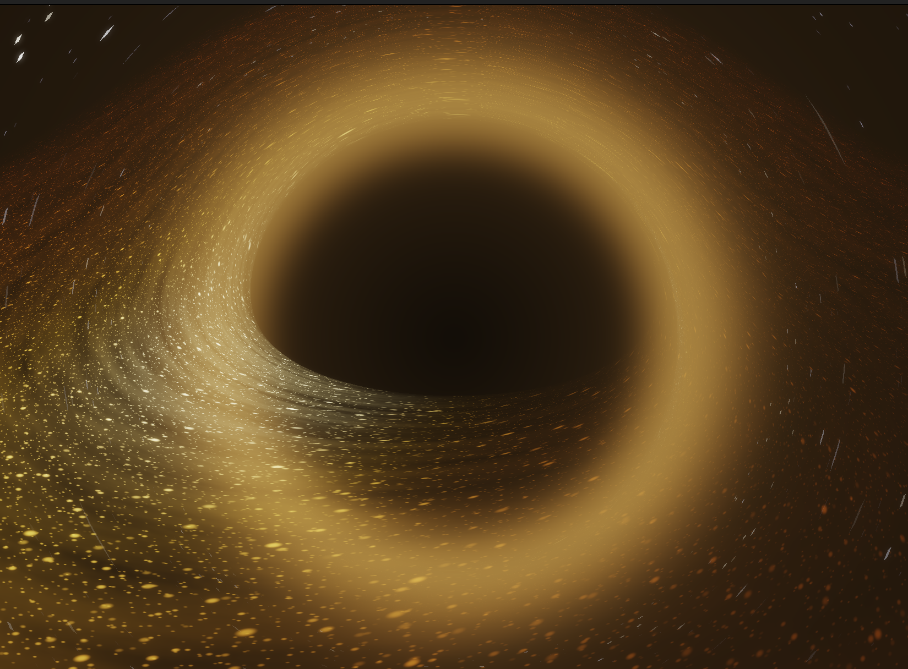
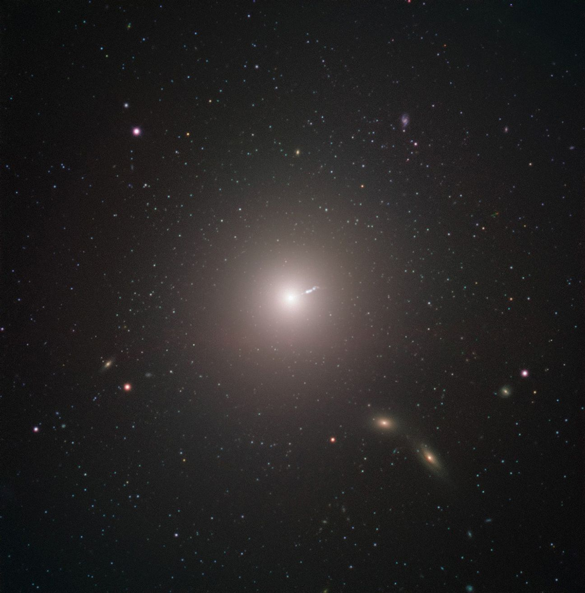

# Schwarzschild-RTX: Real-Time Relativistic Spacetime Engine



A **real-time, interactive simulation** of a static Schwarzschild black hole, built **entirely from scratch** in **C++20** and **OpenGL/GLSL**. Every pixel traces a photon through curved spacetime using the full geodesic equation — gravitational lensing, Doppler beaming, the photon ring, and gravitational redshift are all computed live on the GPU.

The entire physics engine — the `Vec3`/`Vec4` math library, the Runge-Kutta integrator, and the Schwarzschild geodesic equations — was hand-written **without any external math libraries** (no GLM, no Eigen).

> **Performance:** This simulation runs up to 1000 RK4 steps per pixel per frame. A modern dedicated GPU is recommended (NVIDIA GTX 1660+). Default target: **60 FPS** at 800×600 on an RTX 4070.

---

## What is a Black Hole?


*ESA/Hubble, ESO, M. Kornmesser — Annotated illustration of a supermassive black hole*

A black hole is a region of spacetime where gravity is so extreme that nothing — not even light — can escape. The boundary of no return is the **event horizon** ($r_s = 2GM/c^2$). Outside it, superheated gas spirals inward forming the **accretion disk**, while photons grazing the **photon sphere** ($r = 3M$) orbit the black hole before escaping.

This simulation recreates these phenomena in real time on your GPU.

---

## Key Features

- **Physics-Based Ray Tracing** — Every pixel traces a photon through curved Schwarzschild spacetime using the full geodesic equation, not an approximation.

- **M87\* EHT-Matched Color Model** — The accretion disk color gradient is calibrated to the **Event Horizon Telescope** observation of M87\*, reproducing the deep red → orange → golden-yellow palette.

  | Real M87\* (EHT 2019)                                                                                                       | My Simulation                                                                                        |
  | --------------------------------------------------------------------------------------------------------------------------- | ---------------------------------------------------------------------------------------------------- |
  |  |  |
  | *EHT Collaboration — 55 million light-years away*                                                                           | *Schwarzschild-RTX — running on your GPU*                                                            |

- **Relativistic Doppler Beaming** — The approaching side of the disk is dramatically brighter than the receding side, modeled with the full relativistic Doppler factor $\delta = 1/[\gamma(1 - \vec{v} \cdot \hat{n})]$.

  
  *Edge-on view — the left/approaching side of the disk glows brighter than the receding right side*

- **Photon Ring & Higher-Order Lensing** — Rays grazing the photon sphere at $r = 3M$ orbit the black hole multiple times. The simulation traces up to **4 disk crossings**, revealing the thin nested photon ring.

  

- **Gravitational Lensing** — The background starfield and the far side of the disk are visibly warped. The disk "arches" over the top and wraps under the bottom due to light bending.

- **HDR Bloom Post-Processing** — A 3-pass pipeline (scene FBO → 8× ping-pong Gaussian blur → ACES composite) creates cinematic light bleed around the bright inner disk.

- **Flowing Particulate Disk** — The disk is composed of thousands of individual glowing particles, each orbiting at the **Keplerian angular velocity** $\omega(r) = \sqrt{M/r^3}$. Inner particles orbit faster than outer ones — real differential rotation. Eight density layers create the disk body without any smooth continuous fill.

  
  *Macro close-up — individual particles spiraling at Keplerian velocity, HDR bloom creating the soft glow*

- **Interactive CAD-Style Camera** — Full orbit, zoom, and pan controls. Inspect the black hole from any angle in real time.

  https://github.com/user-attachments/assets/wasd_camera_demo.mp4

---

## Demo Videos

### WASD Camera Navigation
https://github.com/user-attachments/assets/wasd_camera_demo.mp4

*Full orbit, zoom, and pan around the black hole using mouse drag and WASD keys.*

### Particle Flow Close-Up
https://github.com/user-attachments/assets/particle_flow_demo.mp4

*Individual particles orbiting at Keplerian velocity — inner particles visibly move faster than outer ones.*

> **Note:** The videos above use GitHub embed links. For local viewing, the source files are in `docs/screenshots/wasd_camera_demo.mp4` and `docs/screenshots/particle_flow_demo.mp4`.

---

## Interaction Guide

| Input                 | Action                              |
| --------------------- | ----------------------------------- |
| **Left-click + Drag** | Orbit camera around the black hole  |
| **Scroll Wheel**      | Zoom in / out                       |
| **W / S**             | Pan orbit center forward / backward |
| **A / D**             | Pan orbit center left / right       |
| **Q / E**             | Pan orbit center up / down          |
| **+/-**               | Adjust bloom strength               |
| **ESC**               | Quit                                |

The camera uses **spherical coordinates** (yaw, pitch, radius) with pitch clamped to ±89° to avoid gimbal lock.

---

## How It Works: The Rendering Pipeline

The CPU draws **2 triangles** (a fullscreen quad). The GPU does everything else.

```
┌─────────────────────────────────────┐
│         CPU  (main.cpp)             │
│                                     │
│  1. Poll mouse/keyboard input       │
│  2. Update spherical camera         │
│  3. Set 8 uniforms via glUniform    │
│  4. Trigger 3-pass draw             │
└──────────────┬──────────────────────┘
               ▼
┌─────────────────────────────────────────┐
│  PASS 1 — Scene  (blackhole.frag)       │
│  Renders to RGBA16F HDR framebuffer     │
│                                         │
│  Per pixel:                             │
│  • Construct ray from camera basis      │
│  • RK4 geodesic (up to 1000 steps)     │
│  • Adaptive stepping near r = 3M       │
│  • Up to 4 disk crossings (photon ring)│
│  • 8 particle layers + M87 color       │
│  • Doppler + redshift → raw HDR out    │
└──────────────┬──────────────────────────┘
               ▼
┌─────────────────────────────────────────┐
│  PASS 2 — Bloom Blur (bloom_blur.frag)  │
│  8 iterations, ping-pong between FBOs   │
│                                         │
│  9-tap Gaussian kernel, alternating     │
│  horizontal ↔ vertical                  │
└──────────────┬──────────────────────────┘
               ▼
┌─────────────────────────────────────────┐
│  PASS 3 — Composite (bloom_final.frag)  │
│  Renders to screen (default framebuffer)│
│                                         │
│  color = scene + bloom × strength       │
│  ACES filmic tone mapping               │
│  Gamma correction (1/2.2)               │
└─────────────────────────────────────────┘
```

### Backward Ray Tracing

For each pixel, I construct a 3D ray direction from the camera's basis vectors:

```glsl
// blackhole.frag — main()
vec2 uv = (fragUV - 0.5) * vec2(uResolution.x / uResolution.y, 1.0);

vec3 rayDir = normalize(
    uCamForward +
    uCamRight * (uv.x * uFovScale) +
    uCamUp    * (uv.y * uFovScale)
);
```

### Collision Detection

During ray marching, three outcomes are checked every step:

- **Event Horizon** ($r \leq r_s$) → Pixel is **pure black** (the shadow)
- **Accretion Disk** (Y-plane crossing at $r_{ISCO} \leq r \leq r_{outer}$) → Color from particles + Doppler + redshift
- **Escaped** ($r > r_{escape}$) → Procedural starfield

---

## Core Physics & Mathematical Formulas


*M87 / Virgo A — ESO. The same black hole captured by the EHT in 2019.*

### 1. Schwarzschild Geodesic Equation

The photon's acceleration in Schwarzschild spacetime, in natural units ($G = M = c = 1$):

$$\vec{a} = -\frac{3M \cdot |\vec{L}|^2}{|\vec{r}|^5} \cdot \vec{r}$$

Where $\vec{L} = \vec{r} \times \vec{v}$ is the specific angular momentum. This is the exact effective-potential form — no weak-field approximation.

```glsl
// blackhole.frag — accel()
vec3 accel(vec3 pos, vec3 vel) {
    float r2 = dot(pos, pos);
    float r  = sqrt(r2);
    vec3 h   = cross(pos, vel);
    float h2 = dot(h, h);
    float r5 = r2 * r2 * r;
    return pos * (-3.0 * M * h2 / r5);
}
```

The same equation appears in the C++ physics engine (`src/physics/raytracer.hpp`), which was written first and then ported to GLSL:

```cpp
// raytracer.hpp — calculateAcceleration()
inline vec3 calculateAcceleration(const vec3& pos, const vec3& vel) {
    double r2 = pos.dot(pos);
    double r = std::sqrt(r2);
    vec3 h_vec = pos.cross(vel);
    double h2 = h_vec.dot(h_vec);
    double r5 = r2 * r2 * r;
    return pos * (-3.0 * M * h2 / r5);
}
```


*The Schwarzschild geodesic produces gravitational lensing — the disk arches over the shadow*

### 2. RK4 Numerical Integrator

The ray is integrated using the **4th-order Runge-Kutta method**. Four weighted samples per step dramatically reduce numerical drift compared to Euler:

$$\vec{v}_{i+1} = \vec{v}_i + \frac{1}{6}(\vec{k}_{v1} + 2\vec{k}_{v2} + 2\vec{k}_{v3} + \vec{k}_{v4})$$

```glsl
// blackhole.frag — stepRK4()
void stepRK4(inout vec3 pos, inout vec3 vel, float dt) {
    vec3 k1v = accel(pos, vel);           vec3 k1p = vel;
    vec3 k2v = accel(pos + k1p*dt*0.5, vel + k1v*dt*0.5);
    vec3 k2p = vel + k1v * dt * 0.5;
    vec3 k3v = accel(pos + k2p*dt*0.5, vel + k2v*dt*0.5);
    vec3 k3p = vel + k2v * dt * 0.5;
    vec3 k4v = accel(pos + k3p*dt, vel + k3v*dt);
    vec3 k4p = vel + k3v * dt;

    vel += (k1v + 2.0*k2v + 2.0*k3v + k4v) * (dt / 6.0);
    pos += (k1p + 2.0*k2p + 2.0*k3p + k4p) * (dt / 6.0);
}
```

#### Adaptive Stepping

Near the photon sphere ($r \approx 3M$), the step size shrinks to resolve the thin photon ring:

| Condition                  | Step Scale       | Reason                          |
| -------------------------- | ---------------- | ------------------------------- |
| $r < 1.2 \cdot r_{photon}$ | $0.15 \times dt$ | Resolves photon ring sub-images |
| $r < 2.0 \cdot r_{photon}$ | $0.40 \times dt$ | Near-horizon accuracy           |
| $r < 10M$                  | $0.70 \times dt$ | Proper disk intersection        |
| $r > 10M$                  | $1.0 \times dt$  | Full speed in weak-field        |

### 3. Accretion Disk Physics

#### Particulate Disk Model

The disk is not a smooth surface — it is built from **individual flowing particles**. Each particle is a soft circular dot in a polar $(r, \theta)$ grid cell. The angular grid density scales with radius to ensure **uniform arc-length**:

```glsl
// blackhole.frag — particleLayer()
vec2 cell = vec2(diskR * rScale, flowAngle * aScale * diskR);
```

Eight density layers (4 dense + 2 medium + 2 sparse) are composited. Each layer has independent spawn probability, flicker timing, and random offsets.


*Each dot is a procedural particle. The inner ring orbits faster — differential rotation.*

#### Keplerian Differential Rotation

Each particle orbits at:

$$\omega(r) = \sqrt{\frac{M}{r^3}}$$

```glsl
float omega = sqrt(M / (diskR * diskR * diskR));
float flowAngle = angle + time * omega;
```

#### M87\* Temperature Profile

$$T(r) = T_{max} \cdot \left(\frac{r_{ISCO}}{r}\right)^{3/4}$$

Mapped to a 5-stop color ramp calibrated to the M87\* EHT observation:

```glsl
// blackhole.frag — m87ColorRamp()
// Stop 0: dark red-brown   (0.15, 0.02, 0.0)   — outer, coolest
// Stop 1: deep red         (0.6,  0.08, 0.01)
// Stop 2: rich orange      (0.95, 0.35, 0.04)
// Stop 3: golden yellow    (1.0,  0.65, 0.12)
// Stop 4: yellow-white     (1.0,  0.88, 0.5)   — inner, hottest
```

#### Doppler Beaming

$$\delta = \frac{1}{\gamma \left(1 - \vec{v}_{gas} \cdot \hat{n}\right)}, \qquad \gamma = \frac{1}{\sqrt{1 - v^2}}, \qquad I_{obs} \propto \delta^3$$

```glsl
// blackhole.frag — diskShade()
vec3 orbitDir  = normalize(cross(vec3(0, 1, 0), radialDir));
float v_orb    = sqrt(M / diskR);
float v_dot_n  = dot(orbitDir * v_orb, toCamera);
float gamma    = 1.0 / sqrt(max(1.0 - v_orb * v_orb, 0.01));
float doppler  = 1.0 / (gamma * (1.0 - v_dot_n));
float intensity = pow(clamp(doppler, 0.15, 3.5), 3.0);
```

#### Gravitational Redshift

$$z_{grav} = \sqrt{1 - \frac{r_s}{r}}$$

Dims light emitted close to the horizon, creating the smooth fade into the pure-black shadow.

### 4. HDR Bloom Pipeline

The scene renders to **RGBA16F** (values can exceed 1.0). The bloom pipeline spreads these HDR highlights into a cinematic halo:

1. **Scene Pass** → RGBA16F FBO (raw HDR, no tone mapping)
2. **Blur Pass** → 8 iterations of 9-tap Gaussian, ping-pong H↔V
3. **Composite** → `color = scene + bloom × strength` → ACES tone mapping → gamma

```glsl
// bloom_final.frag — composite pass
vec3 scene = texture(uScene, fragUV).rgb;
vec3 bloom = texture(uBloom, fragUV).rgb;
vec3 color = scene + bloom * uBloomStrength;

// ACES filmic tone mapping
vec3 x = color * uExposure;
color = (x * (2.51 * x + 0.03)) / (x * (2.43 * x + 0.59) + 0.14);
```

---

## Project Architecture

```
Schwarzschild-RTX/
├── src/
│   ├── main.cpp                      ← Entry point (input loop + uniform dispatch)
│   ├── core/
│   │   ├── display.hpp               ← GLFW window, 3 shader programs, bloom FBO pipeline
│   │   └── camera.hpp                ← Spherical orbit camera (CAD-style)
│   ├── math/
│   │   ├── Vec3.hpp                  ← 3D vector (dot, cross, normalize) — hand-written
│   │   └── Vec4.hpp                  ← 4D homogeneous vector — hand-written
│   ├── physics/
│   │   └── raytracer.hpp             ← C++ RK4 integrator + Schwarzschild geodesic
│   └── shaders/
│       ├── blackhole.vert            ← Fullscreen quad vertex shader (pass UVs)
│       ├── blackhole.frag            ← GPU ray tracer (355 lines of GLSL)
│       ├── bloom_blur.frag           ← 9-tap Gaussian blur (ping-pong)
│       └── bloom_final.frag          ← ACES tone mapping + bloom composite
├── tests/
│   ├── CMakeLists.txt
│   ├── math/
│   │   ├── vec3_test.cpp             ← 15 assertions (operations, identities, edge cases)
│   │   └── vec4_test.cpp             ← 10 assertions (+ homogeneous coordinate semantics)
│   └── physics/
│       └── physics_test.cpp          ← 13 assertions (acceleration, RK4, photon tracing)
├── third_party/
│   └── glad/                         ← OpenGL loader (generated)
├── docs/
│   └── screenshots/                  ← All images and videos for this README
├── .github/
│   └── workflows/
│       └── ci.yml                    ← GitHub Actions: build + test on every push
├── CMakeLists.txt
└── README.md
```

### Source Code Guide

| File               | Lines | What It Does                                                                                                                                                |
| ------------------ | ----- | ----------------------------------------------------------------------------------------------------------------------------------------------------------- |
| `Vec3.hpp`         | 73    | Custom 3D vector: `+`, `-`, `*`, `/`, `dot`, `cross`, `length`, `normalize`. Optimized division uses multiply-by-inverse.                                   |
| `Vec4.hpp`         | ~80   | 4D homogeneous coordinates. `w=1` for points, `w=0` for directions. Cross product forces `w=0`.                                                             |
| `raytracer.hpp`    | 108   | C++ Schwarzschild geodesic `calculateAcceleration()`, `stepRK4()`, `tracePhoton()` with disk intersection. Natural units ($G=M=c=1$).                       |
| `camera.hpp`       | 126   | Spherical orbit camera. `yaw`/`pitch`/`radius` around a moveable center. Pitch clamped to ±89°. WASD pans the orbit center.                                 |
| `display.hpp`      | 302   | GLFW window + GLAD init. Compiles 3 shader programs. Creates RGBA16F framebuffers. Executes the 3-pass bloom pipeline in `draw()`.                          |
| `main.cpp`         | 120   | Main loop: poll GLFW input → update camera → set 8 uniforms → `display.draw()`.                                                                             |
| `blackhole.frag`   | 355   | The GPU ray tracer. RK4 integrator, `particleLayer()`, `diskShade()`, `m87ColorRamp()`, `starfield()`, `photonGlow()`, adaptive stepping, 4 disk crossings. |
| `bloom_blur.frag`  | 33    | 9-tap Gaussian blur. `uHorizontal` toggles direction. Called 16× (8 ping-pong iterations).                                                                  |
| `bloom_final.frag` | 30    | Composites scene + bloom, ACES filmic tone mapping, gamma correction 1/2.2.                                                                                 |
| `blackhole.vert`   | 12    | Fullscreen quad. Passes UV coordinates to the fragment shader.                                                                                              |

---

## Build & Run

### Requirements

- **C++20** compiler (GCC 11+ or Clang 14+)
- **CMake** 3.10+
- **GLFW 3.3+** (`sudo apt install libglfw3-dev`)
- **OpenGL 3.3+** capable GPU + drivers

### Build

```bash
git clone https://github.com/<your-username>/Schwarzschild-RTX.git
cd Schwarzschild-RTX
mkdir build && cd build
cmake ..
make -j$(nproc)
```

### Run

```bash
# On hybrid GPU systems (laptop with NVIDIA + Intel):
__NV_PRIME_RENDER_OFFLOAD=1 __GLX_VENDOR_LIBRARY_NAME=nvidia ./BlackHoleSim

# On desktop / single GPU:
./BlackHoleSim
```

You should see:
```
OpenGL Version: 3.3.0 NVIDIA 570.211.01
GPU: NVIDIA GeForce RTX 4070 Laptop GPU/PCIe/SSE2
```

> **⚠️ Warning:** If you see `Mesa Intel(R) Graphics`, the simulation is running on the integrated GPU. Use the PRIME offload command above.

### Run Tests

```bash
cd build
ctest --output-on-failure
```

All 38 assertions across 3 test suites (Vec3, Vec4, Physics) must pass.

---

## Unit Tests

| Suite       | File                             | Assertions | What It Tests                                                                                                                                                                   |
| ----------- | -------------------------------- | ---------- | ------------------------------------------------------------------------------------------------------------------------------------------------------------------------------- |
| **Vec3**    | `tests/math/vec3_test.cpp`       | 15         | Addition, subtraction, scalar ops, dot, cross, length, normalize, zero vector, self-dot = length², cross ⊥ both inputs                                                          |
| **Vec4**    | `tests/math/vec4_test.cpp`       | 10         | All Vec3 ops + homogeneous semantics: Point − Point = Direction, Point + Direction = Point                                                                                      |
| **Physics** | `tests/physics/physics_test.cpp` | 13         | Acceleration direction & magnitude scaling, RK4 angular momentum conservation, photon capture/escape/disk-hit, natural unit constants, near-horizon stability, weak-field limit |

CI runs automatically on every push via GitHub Actions (`.github/workflows/ci.yml`).

---

## Development Phases

| Phase         | Focus                                                          | Status     |
| ------------- | -------------------------------------------------------------- | ---------- |
| **Phase 1**   | Linear Algebra Core (`Vec3`, `Vec4`, operator overloading)     | ✅ Complete |
| **Phase 2**   | Schwarzschild Metric + RK4 Numerical Integrator                | ✅ Complete |
| **Phase 3**   | Accretion Disk + Gravitational Lensing + Background Sky        | ✅ Complete |
| **Phase 4**   | CPU Multi-threading with `std::jthread` (performance baseline) | ✅ Complete |
| **Phase 5**   | GPU Fragment Shader Migration + M87 Color Model + CAD Camera   | ✅ Complete |
| **Phase 5.1** | HDR Bloom Post-Processing Pipeline (3-pass, ping-pong FBOs)    | ✅ Complete |
| **Phase 5.2** | Flowing Particulate Disk (8-layer Keplerian orbital particles) | ✅ Complete |
| **Phase 5.3** | Unit Tests + GitHub Actions CI                                 | ✅ Complete |
| **Phase 6**   | Kerr Metric (rotating black hole, frame-dragging)              | 🔲 Planned  |
| **Phase 7**   | Real Star Catalog Background (Hipparcos/Tycho-2)               | 🔲 Planned  |

---

## Gallery

|                                                                                                        |                                                                                                     |
| ------------------------------------------------------------------------------------------------------ | --------------------------------------------------------------------------------------------------- |
|        |         |
| *Oblique close-up — HDR bloom halo around the photon sphere*                                           | *Edge-on — Doppler beaming creates a bright crescent*                                               |
|  |  |
| *Face-on — photon ring, M87 temperature gradient*                                                      | *Macro — individual Keplerian particles spiraling inward*                                           |

### Reference Comparison

| Real M87\* (EHT 2019)                                                      | My Simulation                                                          |
| -------------------------------------------------------------------------- | ---------------------------------------------------------------------- |
|  |  |
| *55 million light-years away*                                              | *Real-time on an RTX 4070*                                             |

---

## References & Further Reading

- **Schwarzschild, K.** (1916). *Über das Gravitationsfeld eines Massenpunktes nach der Einsteinschen Theorie.* [arXiv:physics/9905030](https://arxiv.org/abs/physics/9905030)
- **Event Horizon Telescope Collaboration** (2019). *First M87 Event Horizon Telescope Results.* [ApJL, 875, L1](https://doi.org/10.3847/2041-8213/ab0ec7)
- **Luminet, J.-P.** (1979). *Image of a Spherical Black Hole with Thin Accretion Disk.* [A&A, 75, 228](https://ui.adsabs.harvard.edu/abs/1979A%26A....75..228L)
- **Press, W. H. et al.** (2007). *Numerical Recipes: The Art of Scientific Computing (3rd Edition)* — Chapter 17: Ordinary Differential Equations

### Visual Inspiration

- **rossning92/Blackhole** — https://github.com/rossning92/Blackhole
- **Silvera0218/BlackHole-Simulation** — https://github.com/Silvera0218/BlackHole-Simulation

---

## Disclaimer: AI Transparency

I designed and built this entire simulation from scratch — the math library, the physics engine, the RK4 integrator, the Schwarzschild geodesic solver, the rendering architecture, and the shader pipeline. An AI coding assistant (Google Gemini) was used during development for **code review, debugging, and polish** on the GPU rendering layer (shader syntax, OpenGL boilerplate, bloom pipeline setup, and documentation formatting). The core physics engine and all mathematical foundations remain entirely my own original work, unmodified and untouched by AI.

---

## License

Distributed under the **MIT License**. See `LICENSE` for more information.

---

*Built with passion for General Relativity and real-time graphics.*
*— Ashwin, 2026*
